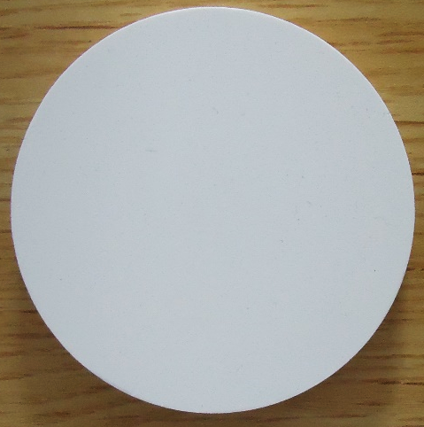
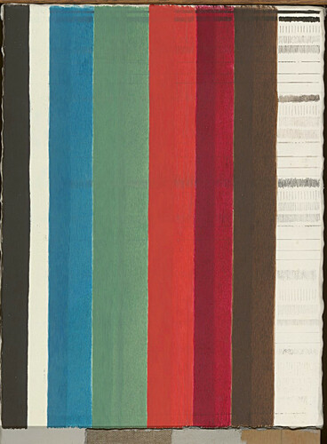

# Hyperspectral Round-Robin Test Data

This repository contains spectral data acquired from a round-robin test of pushbroom hyperspectral imaging systems and accompanies the article [*"Evaluation of the Data Quality from a Round-Robin Test of Hyperspectral Imaging Systems"*](https://www.mdpi.com/1424-8220/20/14/3812/htm)

> Pillay, R.; Picollo, M.; Hardeberg, J.Y.; George, S. Evaluation of the Data Quality from a Round-Robin Test of Hyperspectral Imaging Systems. Sensors 2020, 20, 3812.
> DOI: 10.3390/s20143812

The data here is from 14 different pushbroom hyperspectral systems from 3 different manufacturers.  The data was acquired by 8 different institutions spectral data from the visible, near infra-red and short-wave infra-red regions was acquired of 2 different test targets.

The spectral data for each system was acquired under the normal operating conditions with the data calibrated and processed using the standard processing pipeline for that system. The goal of this round-robin test  was **not** to compare the hardware specifications or raw performance of the imaging devices themselves, but to measure the resulting effective performances of the systems globally under their standard operating conditions and after the application of the calibration and processing workflows that are usually applied by each institution to their system The goal, therefor, was to evaluate the effective limits in accuracy of the spectral imaging equipment currently in use within these institutions.

The round-robin test was carried out as part of the [COSCH project](http://cosch.info). For more information on the project, see the [COSCH book](https://coschbook.wordpress.com/) and for an overview on the round-robin test, see [chapter 8](https://coschbook.wordpress.com/8-2/).

# Test Targets

StackEdit stores your files in your browser, which means all your files are automatically saved locally and are accessible **offline!**

## Wavelength Standard

## Pigment Panel

# Data
The data here includes the acquired spectra from each of the 14 hyperspectral systems after processing and calibration by each institution. For the wavelength standard, the data from a circular area of 2/3 of the size of the target was used and averaged to give the final representative spectra for each system. For the pigment panel, rectangular area of 2/3 of the width of the color strip was used to produce an average.

The data is organized according to spectral range with data from the visibible and near infra-red regions in the VNIR directory and data from the short-wave infrared in the SWIR directory. Each data file represents the data from a single system.

## Data Format

Each data file is organized in tabular form with each column separated by a space character. The first column contains the center wavelengths of each spectral band and each other contains the spectra from one of the targets. All spectra are floating point and normalized with a theoretical maximum of 1.0. The columns are:

 1. Band center wavelength
 2. Wavelength standard
 3. BurntUmber (Thin)
 4. BurntUmber (Thick)
 5. Carmine (Thin)
 6. Carmine (Thick)
 7. Vermilion (Thin)
 8. Vermilion (Thick)
 9. Malachite (Thin)
 10. Malachite (Thick)
 11. Azurite (Thin)
 12. Azurite (Thick)
 13. Lead White
 14. Ivory Black
 15. Gypsum Ground
  
The data files can be easily opened in Python or other data processing software. For example:

    import numpy as np
    spectra = np.loadtxt( "VNIR/Hyspex1800.csv" )
    wavelengths = spectra[:,0]
    wavelength_standard = spectra[:,1]
    azurite_thick = spectra[:,11]

The reference spectra are also provided. The file wavelength_standard_reference.csv contains the 2 columns, wavelength and reflectance. The file pigment_panel_reference.csv contains the wavelength and spectra for each pigment in the same order as above. 

